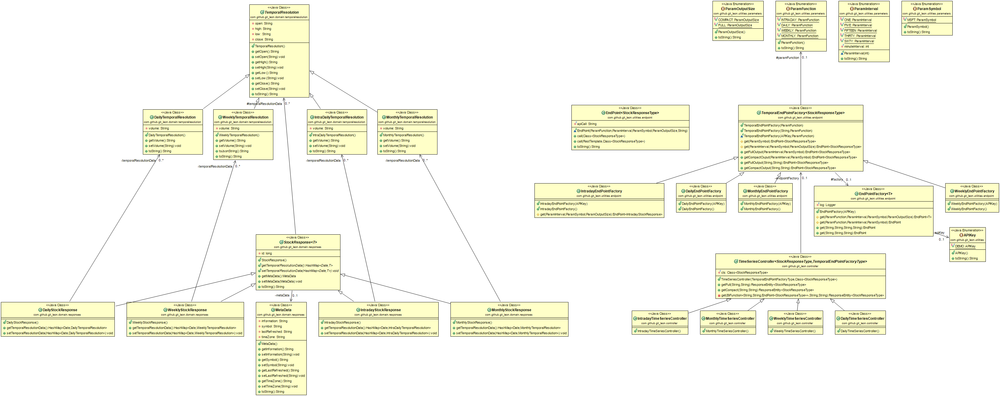

# Alphavantage API
* This project is a java library orientated around Alphavantages stock analysis API.
* This project can be decorated by an API to create a service which leverages Alphavantages API.
* You can read more about this project by accessing the [javadocs](https://git-leon.github.io/spring.alphavantagewrapper/docs/index.html) or viewing the [uml](https://raw.githubusercontent.com/Git-Leon/spring.alphavantagewrapper/master/uml.png)

